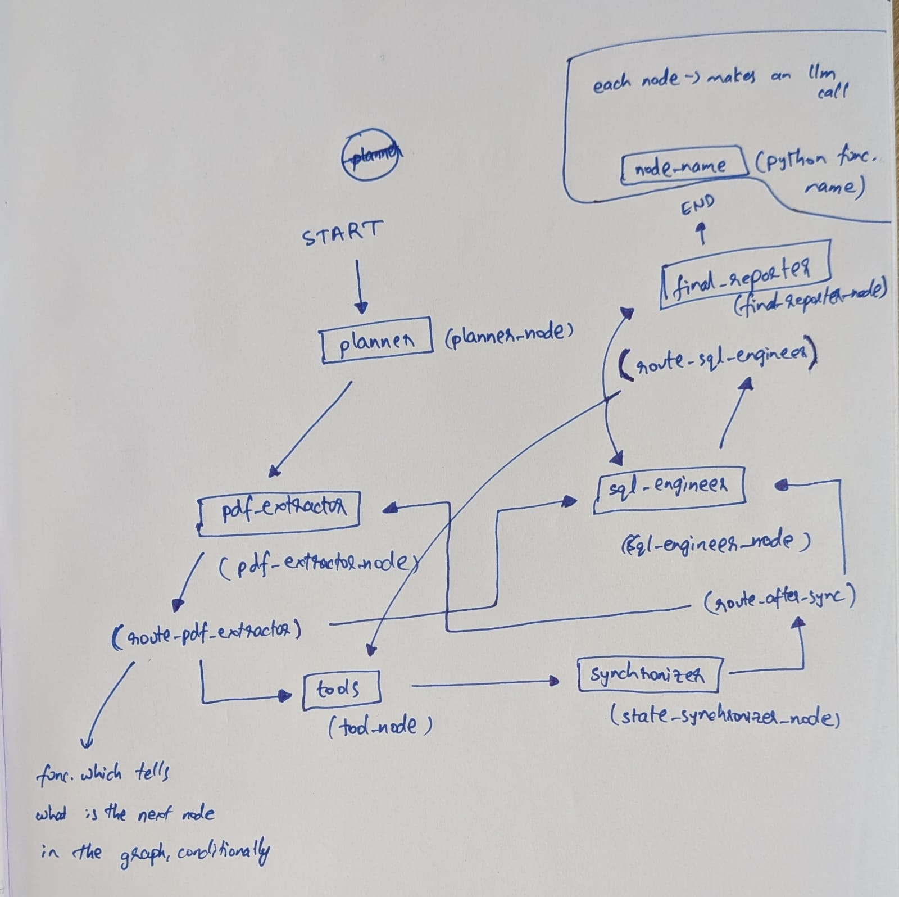

## 17th July 2026

1. I was drawing the flow of state from one agent to another neatly using draw.io and understanding each part of it. While doing this, it wasn't making sense as to how can route_sql_engineer send the control back to sql_engineer agent when there's an error in running the generated sql query. Because, if there's an error, the synchronizer agent would update it in the state and the route_after_sync method will send the control back to sql_engineer agent. So, the agent would already see the error through the past messages (which would also include the tool message) and would give a corrected query as tool call again. So, we would never have a flow wherein after the "sql_engineer" agent we would go back to it immediately - we have to either go to tools or to the next final_reporter agent. Thus, the initial code given by gemini had this "dead code" which was never reachable. I understood the flow of state/tokens in the cyclic graph through the drawing and corrected this mistake from vibe code instead of blindly keeping it.

## 14th July 2026

1. After getting all the code (using Gemini) required for basic query testing, I could not wrap my head around what all these functions mean. So, i read through all the generated code and using a pen and paper mapped everything i.e.,
  - A node is defined by a python function - which can make an llm call, or call a tool, or just update the state
  - I can link two nodes either through a direct edge (when it's obvious) or through a conditional edge (when the last result determines what to do next)
  - For a conditional edge, i need to define just another python function which also has access to the state, and return a string - which will be used in the "add_conditional_edges" method to map to the corresponding node.
  - Langgraph methods
    1. add_node - requires the name of the node and the corresponding python function
    2. add_edge - requires just the names of the two nodes
    3. add_conditional_edges - requires the start node name, then the python function which returns a string conditionally, and a dict which maps the possible str outputs of the python function to the names of the nodes
    4. StateGraph - method to initialize the graph which works on state object
    5. compile - compile the graph AFTER adding all the nodes, edges and conditional edges
  - The diagram of the graph that I drew using pen and paper is this - 

2. Reading the PDF properly
  - Even after using pypdf python package, the extracted text from the pdf contains a lot of newline characters attached to each word before and after. The regex present was not able to capture it properly as well.
  - So, instead of this pypdf package, used the pymupdf package to better read the pdf document - which uses a powerful C-based engine underneath that natively computes the actual structural reading order and groups paragraphs naturally.

## 10th July 2026

1. **Blocker** - How to get an API key for an LLM (specifically Gemini since I already signed up on Google AI Studio) for this project?
   - The API key in the Free Tier is very limiting that even just one run of the script is reaching the RPM limit
   - While I was taking a backup of data in my Pixel 9a to give to repair, I came across this Google One offer for 3 months for Google AI Pro plan which costs me the same 130 rs. per month that I am paying now for 100 GB storage plan.
   - The benefit said this - Gemini app with 4x higher usage limits - this looked like the perfect thing for my needs - same monthly subscription fees for a limited time (3 monthis is a very sufficient enough for this project) but with higher usage limits. So subscribed to this - with a task created to cancel the subscription just before the 3 month offer expires.
   - After subscribing, I realized that this higher limit applies only in the Gemini app and AI studio interface and not for API Keys for Gemini.
   - Asked Gemini again for all the benefits of this google ai pro 5tb package. It said I'll also get $10 Monthly Google Cloud Credits - an aha! moment
   - So, I first upgraded my billing tier from Free tier to paid Tier 1 (adding a CC with E-mandate) which created a new google cloud billing account and then, figured out how to claim these credits on https://me.developers.google.com/benefits and linked them on the newly created google cloud billing account
   - Then, even with this credits in place, I was still seeing this message - "A credit balance above $0 is required to resume service." - this was some Google's new Prepay billing system things - which is, I have to purchase some minimum credits first, before the billing kicks in - which would then utilizie the $10 credits first and then the purchased credits. So, bought the minimum 1000 rs credits and started using the API key in the project.
   - Also, while doing all this, I happened to look at the Documentation link present in Google AI Studio and landed at the Pricing page - which shows the pricing for all the different LLM models from Gemini
   - Asked Gemini to suggest me the right model to use for this Langgraph Agents project considering this $10 credits. It suggested "gemini-3.1-flash-lite" with this line - "To give you an idea of how far this goes: $1.00 will get you roughly 4 million input tokens. Your $10 monthly developer credit essentially means you can run hundreds of thousands of multi-turn agent execution loops every month without ever touching your actual cash balance."

   **Learnings**:
   - Choosing the right LLM model for multi agents orchestration - keeping in mind the cost of tokens, latency of the model, llm capabilities - structured outputs and function calling.
   - Tiers in Google AI Studio and their Rate Limits. Credits Prepay vs Postpay. Minimum credits purchase needed to use the API key even with free $10 credits.
   - Google cloud billing account setup, Getting the free $10 credits into this billing account.
   - Google One AI Pro plan benefits page - https://me.developers.google.com/benefits


2. Last week, after getting the first draft of the complete multi agents code using langgraph, by leveraging gemini for all code, trying to run it gave these warnings in console

   ```
   LangGraph Multi-Agent Mesh Compiled Successfully!

   Adding a node to a graph that has already been compiled. This will not be reflected in the compiled graph.

   Adding an edge to a graph that has already been compiled. This will not be reflected in the compiled graph.

   Starting Multi-Agent Orchestration Testing...
   ```
    **Issue**: This was happening because the graph (containing agents via nodes, edges) was complied before adding the "final_reporter" node and linking it using an edge.

    **Fix**: So, moved this line `app = workflow.compile()` after adding all the nodes, edges and conditional edges to the state graph

   ---

3. Last week, the initial code given by Gemini to read a PDF file using simple `f.read()` was giving this below error
   ```
   UnicodeDecodeError: 'utf-8' codec can't decode byte 0xd3 in position 10: invalid continuation byte
   ```
   **Issue**: PDFs are complex binary files and not plain text files to be able to read them as UTF-8 text files.

   **Fix**: Used `pypdf` python package to read the PDF document.
